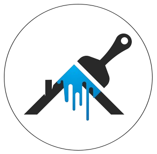

<a name="readme-top"></a>

<div align="center">

[![Contributors][contributors-shield]][contributors-url]
[![Forks][forks-shield]][forks-url]
[![Stargazers][stars-shield]][stars-url]
[![Issues][issues-shield]][issues-url]

</div>

<!-- PROJECT LOGO -->
<br />
<div align="center">
<a href="https://github.com/Kyziq/artistry-hub">
    
</a>

<h3 align="center">ArtistryHub</h3>

  <p align="center">
    <!-- <br /> -->
    <!-- <a href="https://github.com/Kyziq/artistry-hub"><strong>Explore the docs »</strong></a> -->
    <!-- <br /> -->
    <!-- <br /> -->
    <a href="https://kyziq.github.io/artistry-hub">View Demo</a>
    ·
    <a href="https://github.com/Kyziq/artistry-hub/issues">Report Bug</a>
    ·
    <a href="https://github.com/Kyziq/artistry-hub/issues">Request Feature</a>
  </p>
</div>

<!-- TABLE OF CONTENTS -->
<details>
  <summary>Table of Contents</summary>
  <ol>
    <li>
      <a href="#about-the-project">About The Project</a>
      <ul>
        <li><a href="#built-with">Built With</a></li>
      </ul>
    </li>
    <li>
      <a href="#getting-started">Getting Started</a>
      <ul>
        <li><a href="#prerequisites">Prerequisites</a></li>
        <li><a href="#installation">Installation</a></li>
      </ul>
    </li>
    <li><a href="#contributing">Contributing</a></li>
  </ol>
</details>

<!-- ABOUT THE PROJECT -->

## About The Project

ArtistryHub is a digital gallery where users can explore some of the world's most famous and renowned paintings. This platform is designed with simplicity and elegance, utilizing latest technologies to offer a smooth and accessible browsing experience. Perfect for art enthusiasts and casual viewers alike, ArtistryHub provides a window to the rich world of art history, presenting each masterpiece in a format that's easy to navigate and enjoy. Whether you're a seasoned art connoisseur or just curious about the world of paintings, ArtistryHub offers a professional and enriching visual journey.

<p align="right">(<a href="#readme-top">back to top</a>)</p>

### Built With

- [![Vite][Vite]][Vite-url]
- [![React][React.js]][React-url]
- [![TailwindCSS][TailwindCSS]][TailwindCSS-url]

<p align="right">(<a href="#readme-top">back to top</a>)</p>

<!-- GETTING STARTED -->

## Getting Started

### Prerequisites

Ensure you have pnpm installed on your system. If not, install it globally using:

```sh
npm install -g pnpm
```

### Installation

Follow these steps to set up the project locally:

1. Clone the project repository:
   ```sh
   git clone https://github.com/Kyziq/artistry-hub.git
   ```
2. Install dependencies with `pnpm`:
   ```sh
   pnpm install
   ```

<p align="right">(<a href="#readme-top">back to top</a>)</p>

<!-- CONTRIBUTING -->

## Contributing

Contributions are what make the open source community such an amazing place to learn, inspire, and create. Any contributions you make are **greatly appreciated**.

If you have a suggestion that would make this better, please fork the repo and create a pull request. You can also simply open an issue with the tag "enhancement".
Don't forget to give the project a star! Thanks again!

1. Fork the Project
2. Create your Feature Branch (`git checkout -b feature/AmazingFeature`)
3. Commit your Changes (`git commit -m 'Add some AmazingFeature'`)
4. Push to the Branch (`git push origin feature/AmazingFeature`)
5. Open a Pull Request

<p align="right">(<a href="#readme-top">back to top</a>)</p>

<!-- MARKDOWN LINKS & IMAGES -->
<!-- https://www.markdownguide.org/basic-syntax/#reference-style-links -->

[contributors-shield]: https://img.shields.io/github/contributors/Kyziq/artistry-hub.svg?style=for-the-badge
[contributors-url]: https://github.com/Kyziq/artistry-hub/graphs/contributors
[forks-shield]: https://img.shields.io/github/forks/Kyziq/artistry-hub.svg?style=for-the-badge
[forks-url]: https://github.com/Kyziq/artistry-hub/network/members
[stars-shield]: https://img.shields.io/github/stars/Kyziq/artistry-hub.svg?style=for-the-badge
[stars-url]: hhttps://github.com/Kyziq/artistry-hub/stargazers
[issues-shield]: https://img.shields.io/github/issues/Kyziq/artistry-hub.svg?style=for-the-badge
[issues-url]: https://github.com/Kyziq/artistry-hub/issues
[license-shield]: https://img.shields.io/github/license/Kyziq/artistry-hub.svg?style=for-the-badge
[license-url]: https://github.com/Kyziq/artistry-hub/blob/master/LICENSE.txt
[product-screenshot]: images/screenshot.png
[React.js]: https://img.shields.io/badge/React-20232A?style=for-the-badge&logo=react&logoColor=61DAFB
[React-url]: https://reactjs.org/
[TailwindCSS]: https://img.shields.io/badge/tailwindcss-%2338B2AC.svg?style=for-the-badge&logo=tailwind-css&logoColor=white
[TailwindCSS-url]: https://tailwindcss.com/
[Vite]: https://img.shields.io/badge/vite-%23646CFF.svg?style=for-the-badge&logo=vite&logoColor=white
[Vite-url]: https://vitejs.dev/
